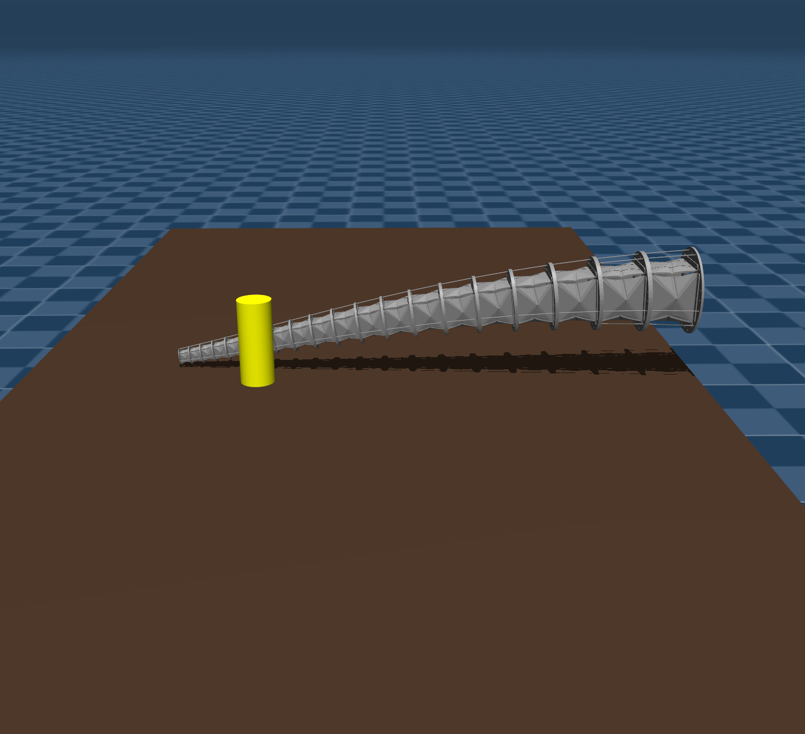
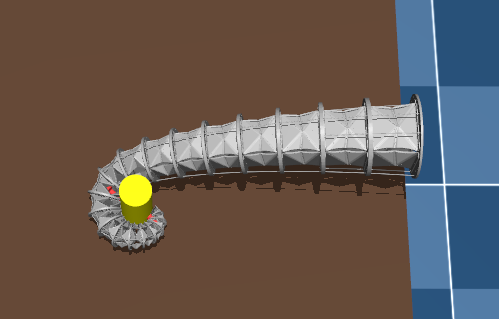

# SoftRopeArm_MuJoCo — Modeling Pipeline

A MuJoCo-based pipeline for assembling a multi-segment, tendon-driven soft robotic arm model, and validating it through grasping and contact-force simulation.

## Overview

The goal of this stage is to build the arm model consumed by [`rl/`](../rl/README_RL.md):

- **Soft robotic arm modeling** — assemble a multi-segment continuum-like arm from per-module XML templates.
- **Physics simulation** — simulate actuation and object interaction using MuJoCo dynamics.
- **Grasping task validation** — test whether the arm can approach, contact, and grasp a target object.
- **Rope/tendon actuation** — drive arm motion through tendon-like actuators.
- **Contact force analysis** — extract and visualize contact forces during grasping.

## Project Structure

```text
modeling/
├── xml/                 # XML templates and generated MuJoCo models
│   ├── 1.xml              # base module template (source for merge.py's step-1 scaling)
│   ├── base.xml            # environment template (source for merge.py's step-3)
│   ├── module.xml          # pre-assembled 20-module arm, used directly by scene4.xml
│   ├── object4.xml         # grasped-object + desk definition, used by scene4.xml
│   └── scene4.xml          # standalone scene: includes module.xml + object4.xml
├── py/                   # per-step generation scripts used by merge.py
│   ├── 1scale_new_module.py
│   ├── 2merge_module.py
│   ├── 3base_add.py
│   └── 4final_assemble.py
├── images/                # result screenshots used in this README
├── merge.py               # orchestrates scaling → merging → base assembly → final XML
├── compute_4.py            # simulation, rope control, and contact-force visualization
└── README.md
```

> **Known gap:** `module.xml` references 10 mesh files under `xml/STL/`
> (`bottom_4x.stl`, `rib_seg2.stl`, `rib_seg3L.stl`, `rib_seg3R.stl`,
> `rib_seg4.stl`, `rib_seg5L.stl`, `rib_seg5R.stl`, `rib_seg6.stl`,
> `bottom_collision.stl`, `top_4x.stl`), but `xml/STL/` doesn't exist in this
> repository — so `scene4.xml` currently fails to load. Files with matching
> names exist under [`rl/STL/`](../rl/STL/); copy or symlink them into
> `modeling/xml/STL/` before running `compute_4.py`.

## Usage

### Generate a full model

```bash
python merge.py --start 1 --end 20 --max-force 10
```

Arguments:
- `--start`: top module index
- `--end`: bottom module index
- `--max-force`: motor `ctrlrange` upper bound applied to every actuator in the final model

This runs five steps — scale each module (`xml/{i}.xml`), merge modules bottom-up,
prepare the base environment (`xml/base{start}_{end}.xml`), assemble the final XML,
and post-process the top-module height/orientation and motor ranges — producing a
file such as:

```text
final1_20.xml
```

### Simulation

```bash
python compute_4.py
```

`compute_4.py` loads `xml/scene4.xml` (a 20-module arm, pre-assembled in
`xml/module.xml`, reaching for a `tube` object on a desk), drives the rope
actuators with a scripted ramp, and renders per-body contact-force arrows in
the viewer for the modules under the `m20_bottom` / `m1_top` body trees. See
the STL note above before running it.

The simulation script supports:
- rope actuator control (scripted force ramps)
- per-body contact-force extraction for the tracked module trees
- contact-force arrow rendering in the MuJoCo viewer

## Dependencies

- Python 3.x
- MuJoCo
- NumPy

## Simulation Result

<p>
  The image shows the initial posture of the soft robotic arm in the simulation.
</p>

<p align="center">
  
</p>

<p>
  The image shows the robotic arm grasping the target object.
</p>

<p align="center">
  
</p>
