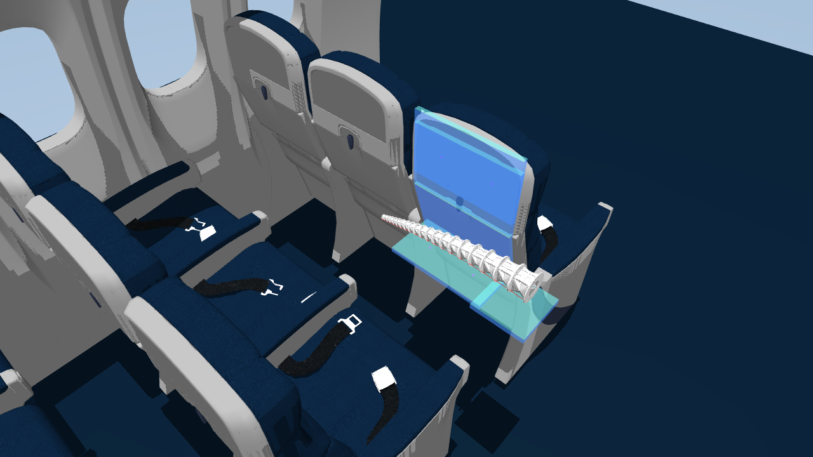

# SoftRopeArm_MuJoCo — Reinforcement Learning Pipeline

RL stage for the six-tendon soft arm model produced by [`modeling/`](../modeling/README.md):
collect a reachable-workspace dataset, then train a SAC agent that learns a small
residual correction on top of an open-loop reference controller built from that dataset.

All scripts below assume they are run from `rl/`, next to `scene.xml`.

## Scene

<p align="center">
  
</p>

`scene.xml` places the arm on a moving plate between two rows of aircraft
seats, reaching toward a tray table — this is the environment `rope_arm_reach_env.py`
and `collect_air_scene_dataset.py` both simulate.

> **Meshes are not included.** `scene.xml` references 10 CAD mesh files under
> `STL/` (`bottom_4x.stl`, `rib_seg2.stl`, `rib_seg3L.stl`, `rib_seg3R.stl`,
> `rib_seg4.stl`, `rib_seg5L.stl`, `rib_seg5R.stl`, `rib_seg6.stl`,
> `bottom_collision.stl`, `top_4x.stl`). These are confidential and cannot be
> made public, so they're excluded from this repository. 

## Files

| File | Purpose |
| --- | --- |
| `rope_arm_reach_env.py` | Gymnasium environment: MuJoCo simulation, six-tendon PID length control, reward, dataset-based reference/target logic. |
| `collect_air_scene_dataset.py` | Samples random tendon-length deltas, drives the arm with PID+ramp control, and records the reached end-effector positions into `dataset/workspace_6rope.{npz,csv}`. |
| `train_sac_rope_arm.py` | Trains a SAC policy in `RopeArmReachEnv`, with a curriculum callback and checkpointing. |
| `eval_train_result.py` | Loads a trained SAC model and runs it headless for N episodes, printing success/timeout/unstable statistics. |
| `demo_dataset_four_points_control.py` | Standalone MuJoCo-viewer demo: sequences the arm through 4 waypoints using dataset-KNN lookup (no trained policy involved). |
| `Interactive_workspace_visualization.py` | Renders the collected dataset (plus scene geometry) as an interactive Plotly HTML scatter. |

## Requirements

```bash
pip install gymnasium stable-baselines3 mujoco pandas numpy tensorboard plotly
```

## Workflow

### 1. Collect a workspace dataset

```bash
python collect_air_scene_dataset.py --samples 2000 --workers 8
```

For each sampled tendon-length delta, the arm is ramped (half-cosine) from its
passively-settled pose to `passive_lengths + delta`, held, and the resulting
end-effector position is recorded. Output:

```text
dataset/workspace_6rope.npz
dataset/workspace_6rope.csv
```

`--workers` controls process-pool parallelism; `Ctrl+C` saves whatever has been
collected so far to `dataset/workspace_6rope.partial.{npz,csv}`. See
`python collect_air_scene_dataset.py --help` for sampling ranges, PID gains, and
plate-position options.

### 2. (Optional) Inspect the dataset

```bash
python Interactive_workspace_visualization.py --csv dataset/workspace_6rope.csv --output workspace.html
```

A pre-generated sample is checked in at
[`interactive_6rope_workspace.html`](interactive_6rope_workspace.html) — open
it in a browser to
drag-rotate and hover the workspace point cloud.

or run the viewer-based waypoint demo, which drives the real arm through 4
hardcoded points using nearest-neighbor lookup in the dataset:

```bash
python demo_dataset_four_points_control.py
```

### 3. Train

```bash
python train_sac_rope_arm.py --total-timesteps 300000
```

Output model:

```text
rl_models/sac_rope_arm_reference_then_rl.zip
```

Checkpoints go to `rl_models/checkpoints/`, TensorBoard logs to `rl_logs/`. Run
`python train_sac_rope_arm.py --help` for the full list of environment, PID, and
curriculum overrides.

### 4. Evaluate

```bash
python eval_train_result.py --model rl_models/sac_rope_arm_reference_then_rl.zip --episodes 100
```

This runs headless (no viewer) and prints a per-episode line plus a summary
(success rate, timeout/unstable counts, mean improvement over the reference
controller). Pass `--zero-action` to benchmark the reference controller alone
(policy replaced with an all-zero action). `--model` defaults to the file
`train_sac_rope_arm.py` saves at the end of training; point it at a checkpoint
under `rl_models/checkpoints/` to evaluate an earlier snapshot.

## Architecture: reference control + residual RL

The policy does not control the arm from scratch. Each episode:

1. Reset MuJoCo and lock the moving plate at the same qpos/ctrl values used by
   the dataset collector.
2. Let the arm settle under gravity with zero rope force (cached to
   `--passive-cache` so this doesn't have to re-run every episode — delete the
   cache file after changing `scene.xml` or the plate setup).
3. Pick a reachable target from the dataset, then execute that row's reference
   tendon-length command using the same half-cosine ramp + hold logic as the
   collector. Rows are retried (up to `--max-reference-retries`) until the
   resulting residual error `||target - reference_tip||` falls inside
   `[--reference-error-min, --reference-error-max]` — this is the curriculum knob.
4. The RL episode starts from this post-reference state. The action is a small
   per-tendon length increment:

   ```text
   action = [Δl1, Δl2, Δl3, Δl4, Δl5, Δl6]        (scaled by --action-scale)
   command_lengths += action * action_scale        (rate-limited, clipped)
   ```

   Commanded lengths are tracked by a per-tendon PID controller that outputs a
   one-way tendon force:

   ```text
   SAC -> Δ target tendon length -> rate limit/clip -> PID -> tendon force -> MuJoCo
   ```

The reward combines progress toward the target, distance, action magnitude/
smoothness, and force penalties, with a success bonus once the tip stays within
`--success-tol` for `--success-hold-steps` consecutive steps.

Note: `RopeArmEnvConfig` still exposes `use_knn_warm_start`/`knn_k` fields for
compatibility with an earlier version of the training script, but the current
environment does not use KNN warm-starting — the dataset row itself *is* the
reference trajectory. KNN lookup is only used by `demo_dataset_four_points_control.py`,
which is independent of training.

## Curriculum

`train_sac_rope_arm.py`'s `build_curriculum()` currently runs a single stage for
the whole run:

```text
step 0: reference_error = [0.020, 0.060] m, success_tol = 0.030 m
```

Three wider stages (at 25%/55%/80% of `--total-timesteps`, widening the residual
range up to `[0.000, 0.180]`) are present in the source but commented out — enable
them there if you want the residual range to grow over training.

If training is unstable early on, try a smaller residual step:

```bash
python train_sac_rope_arm.py --action-scale 0.0003 --force-max 12 --total-timesteps 300000
```

or a larger one once it's stable but slow to converge:

```bash
python train_sac_rope_arm.py --action-scale 0.001 --force-max 20 --total-timesteps 500000
```

## Training strategy

The RL stage does not train the policy from a fixed rest pose or learn
reachability from scratch. It combines three pieces of prior knowledge — all
derived from the offline-collected workspace dataset — into the training
setup:

- **Dataset-anchored reset shaping.** Each episode's initial state distribution
  is not the arm's passive rest pose. `reset()` first replays an open-loop
  reference command taken straight from the dataset — a half-cosine ramp to a
  sampled target's recorded tendon-length delta, held until the tip settles.
  The RL episode then starts from this near-target state, so the policy never
  has to solve gross reachability itself.
- **Staged curriculum via residual-error banding.** How close that reference
  rollout is allowed to land before a dataset row is accepted — the
  `reference_error_min/max` band — is scheduled by training-step count
  (`CurriculumStage`s in `train_sac_rope_arm.py`). Early in training the band
  is narrow (the policy only has to close a small, consistent gap); later
  stages (currently present but disabled, see [Curriculum](#curriculum)) widen
  it so the policy has to correct progressively larger residuals.
- **Incremental residual action space.** Instead of commanding absolute tendon
  lengths, the policy outputs a small `Δl` on top of the reference-derived
  command lengths, tracked by a per-tendon PID. This keeps the action space
  centered on fine correction near the target rather than large-scale
  positioning.

Together this is a **dataset-anchored, staged start-state curriculum**: prior
knowledge collected offline (which points are reachable, and roughly which
tendon deltas reach them) shapes both *where* each episode begins (the initial
state distribution) and *how much* the policy has left to learn (the residual
gap and the action scale), so training effort concentrates on the terminal
reach/correction behavior instead of on rediscovering the workspace.
